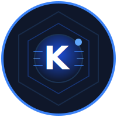
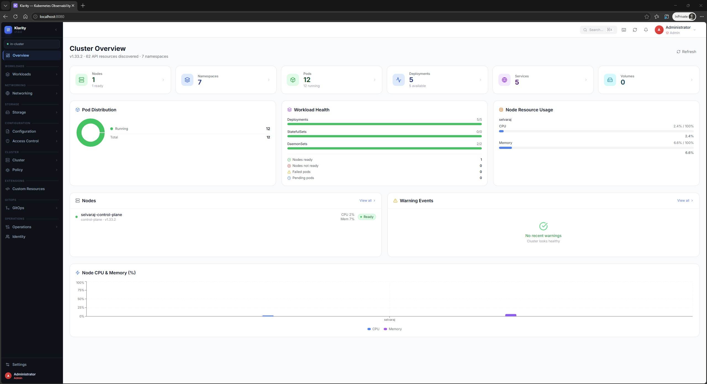
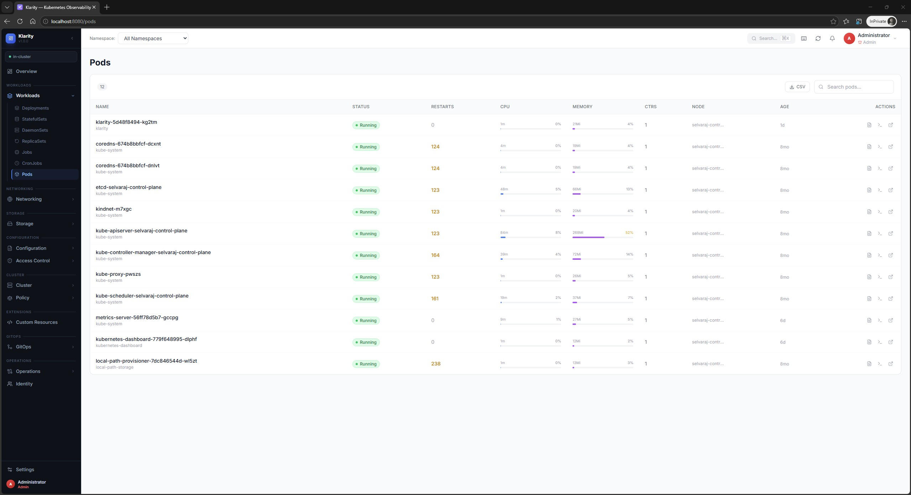
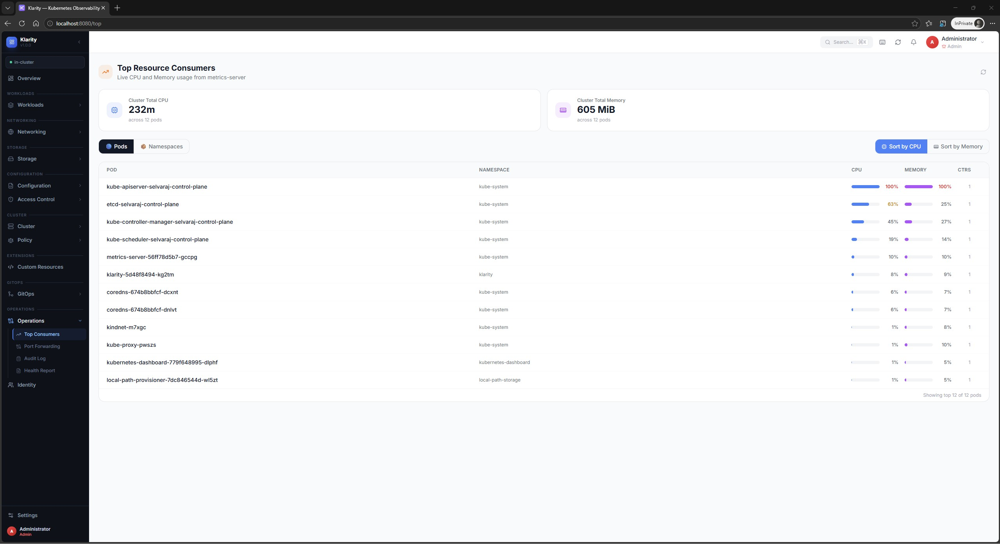
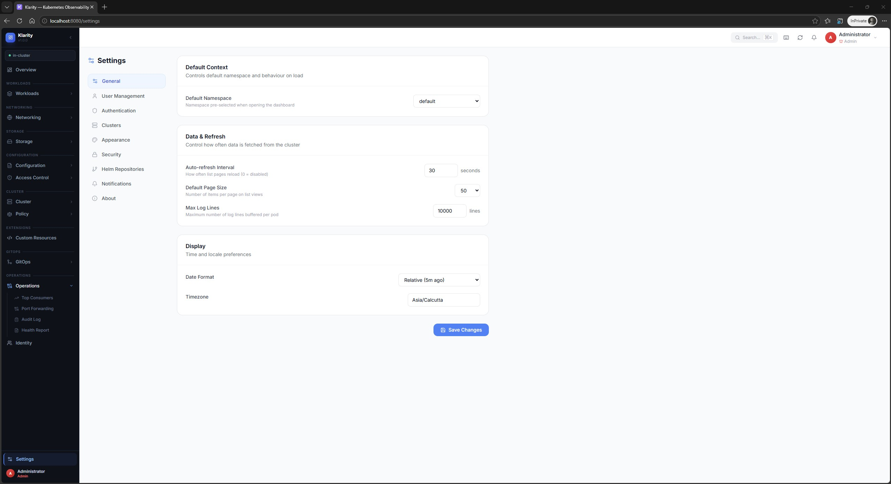
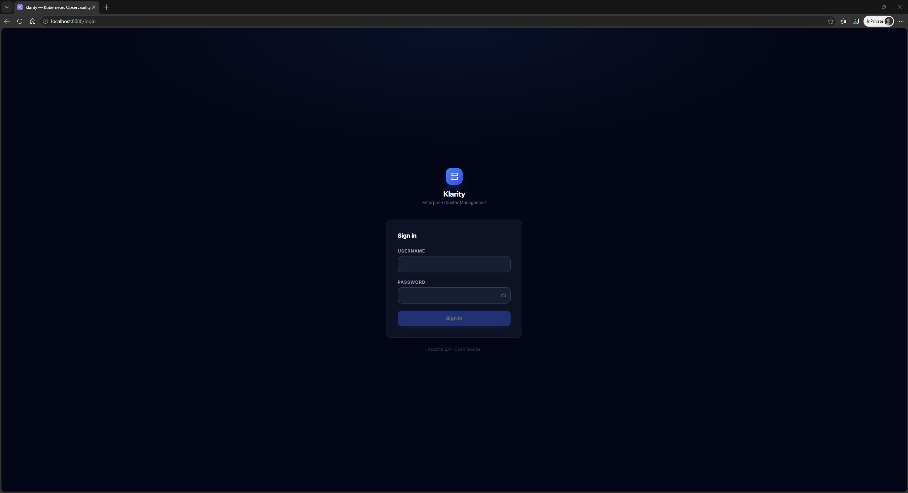
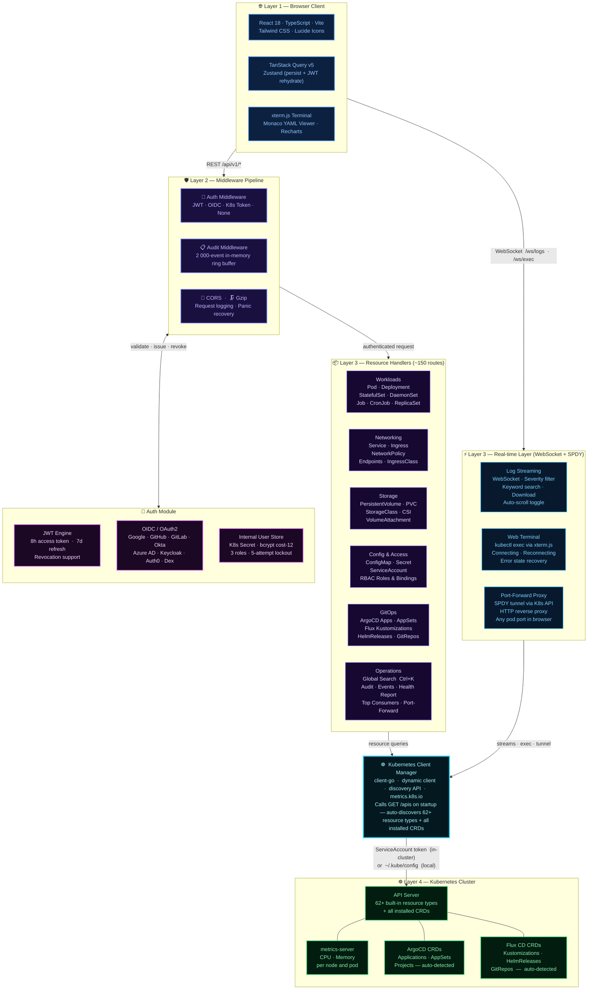

<div align="center">

<br/>



<h1>Klarity</h1>

<h3>Enterprise Kubernetes Observability Dashboard</h3>

<p><strong>Read-only by design &nbsp;·&nbsp; GitOps-first &nbsp;·&nbsp; Auto-discovery &nbsp;·&nbsp; Production-ready</strong></p>

<br/>

[](LICENSE)
[](https://github.com/selvarajmurugesan90/klarity/releases)
[](https://github.com/selvarajmurugesan90/klarity/actions/workflows/ci.yml)

[](https://golang.org)
[](https://kubernetes.io)
[](https://reactjs.org)
[](https://helm.sh)

[](https://github.com/selvarajmurugesan90/klarity/pkgs/container/klarity)
[](https://artifacthub.io/packages/helm/klarity/klarity)
[](https://selvarajmurugesan90.github.io/klarity)

<br/>

> **"Observe everything. Change nothing."**

<br/>

[🚀 Get Started](#-quick-start) &nbsp;·&nbsp; [📖 Documentation](docs/) &nbsp;·&nbsp; [🌐 Website](https://selvarajmurugesan90.github.io/klarity) &nbsp;·&nbsp; [🐛 Issues](https://github.com/selvarajmurugesan90/klarity/issues)

<br/>

</div>

---

## What is Klarity?

**Klarity** is an open-source, enterprise-grade Kubernetes observability dashboard built for teams that follow GitOps practices. It provides complete cluster visibility — every resource, real-time metrics, live log streaming, web terminal, port forwarding, and automatic GitOps integration — all in a single, self-contained binary.

Most dashboards let you edit resources directly. Klarity deliberately **does not** — because in a proper GitOps workflow your cluster's source of truth lives in Git, not a web form. Clicking "edit" in a dashboard bypasses your entire review, audit, and pipeline process.

<br/>

<div align="center">

|  | Klarity | Headlamp | k9s |
|:--|:-------:|:--------:|:---:|
| 🔒 Read-Only / GitOps-First | ✅ | ❌ | ❌ |
| 👥 Internal User Management | ✅ | ❌ | ❌ |
| 🔄 Auto-Detect ArgoCD + Flux | ✅ Zero config | ❌ | ❌ |
| 📋 Audit Log | ✅ | ❌ | ❌ |
| 🖥 Web Terminal (kubectl exec) | ✅ | ✅ | ✅ |
| 🔌 Port Forwarding via Browser | ✅ | ✅ | ❌ |
| 📌 Activities Panel (pinned sessions) | ✅ | ✅ | ❌ |
| 🌐 Web-Based (no install) | ✅ | ✅ | ❌ CLI |
| 📦 Single Binary Deployment | ✅ | ❌ | ✅ |
| 🔍 60+ Resource Types Auto-Discovered | ✅ | ✅ | ✅ |

</div>

---

## Screenshots

<br/>

<div align="center">

### Cluster Overview
*Live metrics · Workload health · Node resource usage · Warning events*



<br/><br/>

### Pods — Real-time Resource Monitoring
*CPU & Memory per pod · Inline progress bars · CSV export · Namespace filter*



<br/><br/>

### Top Resource Consumers
*Live CPU & Memory ranked across all pods · Sort by CPU or Memory · Namespace view*



<br/><br/>

<table>
<tr>
<td align="center" width="50%">

### Settings
*Auto-refresh · Page size · Log lines · Timezone*



</td>
<td align="center" width="50%">

### Login
*Internal auth · K8s token · OIDC/SSO*



</td>
</tr>
</table>

</div>

---

## 🚀 Quick Start

### Option 1 — Helm *(Recommended)*

```bash
# Add the Helm repository
helm repo add klarity https://selvarajmurugesan90.github.io/klarity
helm repo update

# Install
helm upgrade --install klarity klarity/klarity \
  --namespace klarity \
  --create-namespace \
  --set config.authMode=internal

# Access
kubectl port-forward svc/klarity 8080:8080 -n klarity
```

Open [http://localhost:8080](http://localhost:8080) — Default: `admin` / `admin@123` *(change required on first login)*

---

### Option 2 — kubectl / Kustomize *(30 seconds)*

```bash
kubectl apply -k https://github.com/selvarajmurugesan90/klarity/deploy/manifests
kubectl port-forward svc/klarity 8080:8080 -n klarity
```

---

### Option 3 — Docker Compose *(Local Development)*

```bash
git clone https://github.com/selvarajmurugesan90/klarity
cd klarity
docker compose up
```

Open [http://localhost:8080](http://localhost:8080) — Uses `~/.kube/config`, no authentication required.

---

## ✨ Features

### 🔍 Complete Auto-Discovery — 60+ Resource Types

Klarity calls `GET /apis` on startup and maps **every** API group, version, and resource type in your cluster — including all installed CRDs. No configuration. No plugins. If your cluster has Istio, ArgoCD, Cert-Manager, or any operator installed, all their custom resources appear automatically.

<details>
<summary><strong>View all 60+ resource types</strong></summary>

<br/>

| Category | Resources |
|----------|-----------|
| **Workloads** | Pods · Deployments · StatefulSets · DaemonSets · ReplicaSets · Jobs · CronJobs · ReplicationControllers |
| **Networking** | Services · Ingresses · NetworkPolicies · Endpoints · EndpointSlices · IngressClasses |
| **Storage** | PersistentVolumes · PVClaims · StorageClasses · VolumeAttachments · CSIDrivers · CSINodes |
| **Configuration** | ConfigMaps · Secrets *(masked)* · ServiceAccounts · ResourceQuotas · LimitRanges |
| **Access Control** | Roles · ClusterRoles · RoleBindings · ClusterRoleBindings |
| **Policy** | HPAs · PodDisruptionBudgets · PriorityClasses · RuntimeClasses |
| **Admission** | MutatingWebhookConfigurations · ValidatingWebhookConfigurations |
| **Certificates** | CertificateSigningRequests |
| **Coordination** | Leases |
| **Flow Control** | FlowSchemas · PriorityLevelConfigurations |
| **Custom Resources** | Every installed CRD — Istio, ArgoCD, Cert-Manager, Prometheus Operator, etc. |
| **Cluster** | Nodes · Namespaces · Events · ComponentStatuses |

</details>

---

### 🛠 Diagnostic Tools

| Tool | Description |
|------|-------------|
| **Live Log Streaming** | Real-time WebSocket logs with severity filter (ERROR/WARN/INFO/DEBUG), keyword search, auto-scroll, and download |
| **Web Terminal** | Full `kubectl exec` experience via xterm.js — auto-reconnect, no local kubectl required |
| **Port Forwarding** | SPDY HTTP proxy tunnel — access any pod's service port directly in your browser |
| **Activities Panel** | Persistent right-side panel — pin log streams and terminals so they keep running while you navigate |
| **Global Search** | `Ctrl+K` — searches 10 resource types concurrently with instant results |

---

### 🔄 GitOps Integration — Zero Configuration

Klarity automatically detects GitOps tools by scanning cluster CRDs. The **GitOps** sidebar section appears the moment ArgoCD or Flux CD is installed — no setup required.

<table>
<tr>
<td valign="top" width="50%">

**ArgoCD**
- Applications with sync status (Synced / OutOfSync)
- Health status (Healthy / Degraded / Progressing)
- Source repository, target path, current revision
- ApplicationSets and AppProjects

</td>
<td valign="top" width="50%">

**Flux CD**
- Kustomizations with ready status & last reconcile time
- HelmReleases with chart name and version
- GitRepositories, HelmRepositories, OCIRepositories
- Notification alerts and receivers

</td>
</tr>
</table>

---

### 📊 Real-time Observability

- **Live metrics** — CPU & Memory via metrics-server with visual progress bars per node and container
- **Top Consumers** — sort all pods or namespaces by CPU or Memory
- **Container-level metrics** — per-container breakdown inside Pod detail
- **Circular node gauges** — visual CPU/Memory capacity rings on Node detail page
- **Namespace summaries** — aggregate resource usage per namespace
- **Cluster health report** — downloadable self-contained HTML snapshot for compliance or sharing
- **Events** — real-time Kubernetes events with Warning/Normal filter and time range

---

### 🔐 Enterprise User Management

Klarity includes a complete, production-ready internal auth system — no external identity provider required.

| Feature | Detail |
|---------|--------|
| **Password hashing** | bcrypt cost 12 — computationally expensive to brute-force |
| **Roles** | `admin` · `editor` · `viewer` — granular permission levels |
| **Account lockout** | 5 failed attempts → 15-minute lockout |
| **JWT tokens** | 8-hour access tokens + 7-day refresh tokens |
| **Force password change** | Enforced on first login for default accounts |
| **Persistent storage** | Stored in `klarity-users` K8s Secret — survives all restarts |
| **OIDC / SSO** | Google · GitHub · GitLab · Okta · Auth0 · Keycloak · Azure AD · Dex |

---

### 🔑 Role Permissions

| Permission | admin | editor | viewer |
|-----------|:-----:|:------:|:------:|
| Read all resources | ✅ | ✅ | ✅ |
| Stream logs & terminal | ✅ | ✅ | ✅ |
| Port forwarding | ✅ | ✅ | ✅ |
| Restart deployments | ✅ | ✅ | ❌ |
| Trigger CronJobs | ✅ | ✅ | ❌ |
| Cordon / drain nodes | ✅ | ❌ | ❌ |
| Manage users | ✅ | ❌ | ❌ |

---

## 🏗 Architecture



| Deployment | Auth method | Notes |
|-----------|-------------|-------|
| **In-cluster** (Helm / kubectl) | ServiceAccount token auto-mounted at `/var/run/secrets/kubernetes.io/serviceaccount/token` | Zero config, zero secrets |
| **Local / Docker Compose** | `~/.kube/config` — all contexts loaded | Switch cluster from the UI dropdown |

---

## 📦 Installation Guide

### Prerequisites

| Requirement | Version | Notes |
|-------------|---------|-------|
| Kubernetes | 1.26+ | Any distribution |
| kubectl | Any | Only needed for port-forward access |
| Helm | 3.x | Helm installation only |
| metrics-server | Any | Optional — enables CPU/Memory metrics |

---

### Helm — Internal Auth *(Default)*

```bash
helm repo add klarity https://selvarajmurugesan90.github.io/klarity
helm repo update

helm upgrade --install klarity klarity/klarity \
  --namespace klarity \
  --create-namespace \
  --set config.authMode=internal
```

**Default accounts** *(change on first login)*:

| Username | Password | Role |
|----------|----------|------|
| `admin` | `admin@123` | Admin |
| `viewer` | `viewer@123` | Viewer |

---

### Helm — Kubernetes Token Auth

```bash
helm upgrade --install klarity klarity/klarity \
  --namespace klarity --create-namespace \
  --set config.authMode=token

# Generate a token
kubectl create token klarity -n klarity --duration=8h
```

---

### Helm — OIDC / SSO

```bash
# Store the client secret in a K8s Secret
kubectl create secret generic oidc-secret \
  --from-literal=oidcClientSecret=<your-secret> \
  -n klarity

helm upgrade --install klarity klarity/klarity \
  --namespace klarity --create-namespace \
  --set config.authMode=oidc \
  --set config.oidc.issuerURL=https://accounts.google.com \
  --set config.oidc.clientID=klarity \
  --set config.oidc.redirectURL=https://klarity.example.com/callback \
  --set oidcClientSecretRef.name=oidc-secret
```

Supported providers: **Google · GitHub · GitLab · Okta · Auth0 · Keycloak · Azure AD · Dex**

---

### Helm — Production Values

```yaml
# production-values.yaml
replicaCount: 2

config:
  authMode: internal
  logLevel: info
  logFormat: json
  sessionTimeout: 8h

ingress:
  enabled: true
  className: nginx
  annotations:
    cert-manager.io/cluster-issuer: letsencrypt-prod
    nginx.ingress.kubernetes.io/ssl-redirect: "true"
  hosts:
    - host: klarity.company.internal
      paths: [{path: /, pathType: Prefix}]
  tls:
    - secretName: klarity-tls
      hosts: [klarity.company.internal]

resources:
  requests: {cpu: 200m, memory: 256Mi}
  limits:   {cpu: 1000m, memory: 1Gi}

autoscaling:
  enabled: true
  minReplicas: 2
  maxReplicas: 5

podDisruptionBudget:
  enabled: true
  minAvailable: 1
```

```bash
helm upgrade --install klarity klarity/klarity \
  --namespace klarity --create-namespace \
  -f production-values.yaml
```

---

### kubectl / Kustomize

```bash
# Apply manifests
kubectl apply -k https://github.com/selvarajmurugesan90/klarity/deploy/manifests

# Verify
kubectl get all -n klarity

# Access
kubectl port-forward svc/klarity 8080:8080 -n klarity
```

---

## ⚙️ Configuration Reference

| Environment Variable | Helm Key | Default | Description |
|----------------------|----------|---------|-------------|
| `KD_AUTH_MODE` | `config.authMode` | `internal` | `internal` · `token` · `oidc` · `none` |
| `KD_LOG_LEVEL` | `config.logLevel` | `info` | `debug` · `info` · `warn` · `error` |
| `KD_LOG_FORMAT` | `config.logFormat` | `json` | `json` · `text` |
| `KD_SERVER_PORT` | `config.port` | `8080` | HTTP listen port |
| `KD_SERVER_DEFAULTNS` | `config.defaultNamespace` | `default` | Pre-selected namespace in UI |
| `KD_SERVER_SESSIONTIMEOUT` | `config.sessionTimeout` | `8h` | JWT token lifetime |
| `KD_SERVER_MAXLOGLINES` | `config.maxLogLines` | `10000` | Max buffered log lines per stream |
| `KD_SERVER_METRICSENABLED` | `config.metricsEnabled` | `true` | Enable metrics-server integration |
| `KD_AUTH_OIDC_ISSUERURL` | `config.oidc.issuerURL` | — | OIDC discovery URL |
| `KD_AUTH_OIDC_CLIENTID` | `config.oidc.clientID` | — | OAuth2 client ID |

---

## 🔌 Port Forwarding

Access any pod's service port directly in your browser — no `kubectl` needed:

1. Navigate to **Operations → Port Forwarding** in the sidebar
2. Click **New Port-Forward**
3. Select namespace, pod, and remote port
4. Click the generated proxy URL

Klarity creates a SPDY tunnel through the Kubernetes API and exposes the service via a built-in HTTP reverse proxy. Active tunnels show live status and direct browser links.

---

## 📌 Activities Panel

The **Activities Panel** is a persistent right-side drawer that keeps log streams and terminals alive while you navigate:

| Action | How |
|--------|-----|
| Open log stream | Click 📄 on any pod row |
| Open terminal | Click 🖥 on any pod row |
| Pin to Activities | Logs/Terminal tab → "Pin to Activities" |
| Toggle panel | Click **"N active"** in the header, or `g+a` |
| Switch sessions | Tab bar at the top of the panel |

---

## 🌐 Multi-Cluster

```bash
# Create a Secret with multiple kubeconfig files
kubectl create secret generic multi-cluster \
  --from-file=production=~/.kube/prod.yaml \
  --from-file=staging=~/.kube/staging.yaml \
  -n klarity

# Reference in Helm
helm upgrade klarity klarity/klarity \
  --namespace klarity \
  --set existingMultiClusterSecret=multi-cluster
```

Switch clusters from the context dropdown in the top navigation bar at any time.

---

## 📈 Metrics Server

```bash
# Install metrics-server
kubectl apply -f \
  https://github.com/kubernetes-sigs/metrics-server/releases/latest/download/components.yaml

# For kind / minikube — patch for insecure TLS
kubectl patch deployment metrics-server -n kube-system \
  --type='json' \
  -p='[{"op":"add","path":"/spec/template/spec/containers/0/args/-","value":"--kubelet-insecure-tls"}]'
```

Klarity gracefully shows **"metrics unavailable"** if metrics-server is not installed — all other features work normally.

---

## ⌨️ Keyboard Shortcuts

Press `?` anywhere to open the full shortcuts overlay.

| Shortcut | Action | Shortcut | Action |
|----------|--------|----------|--------|
| `Ctrl+K` | Global Search | `?` | Shortcuts overlay |
| `g o` | Overview | `g p` | Pods |
| `g d` | Deployments | `g s` | StatefulSets |
| `g v` | Services | `g i` | Ingresses |
| `g n` | Namespaces | `g N` | Nodes |
| `g e` | Events | `g a` | Audit Log |
| `g I` | Identity | `g h` | Health Report |
| `Esc` | Close modal | | |

---

## 🔒 Security

| Control | Detail |
|---------|--------|
| **Non-root container** | Runs as UID 1000 — never root |
| **Read-only root filesystem** | `readOnlyRootFilesystem: true` |
| **Capabilities** | `drop: [ALL]` — zero Linux capabilities |
| **seccomp profile** | `RuntimeDefault` |
| **Secret masking** | Secret values always shown as `***` in UI |
| **No server-side token storage** | Auth tokens exist only in the browser session |
| **bcrypt passwords** | Cost factor 12 — computationally expensive to brute-force |
| **Account lockout** | 5 failed attempts → 15-minute lockout |
| **Read-only API** | No create/edit/delete for cluster resources |
| **Stateless server** | Safe to restart anytime — no in-flight state lost |

See [SECURITY.md](SECURITY.md) for the vulnerability disclosure policy.

---

## 🏠 Architecture — Project Structure

```
klarity/
├── cmd/server/              # Application entry point (main.go)
├── internal/
│   ├── api/
│   │   ├── handlers/        # 24 HTTP handler files — one per resource group
│   │   ├── middleware/      # Auth, audit logging, CORS, gzip
│   │   └── routes.go        # All ~150 route registrations
│   ├── assets/              # Embedded React build (go:embed)
│   ├── auth/                # User store, bcrypt hashing, JWT sign/verify
│   ├── config/              # Viper configuration loader
│   └── k8s/                 # Kubernetes client manager + discovery
├── web/                     # React 18 frontend (TypeScript + Vite)
│   └── src/
│       ├── components/      # Layout, common UI, ActivityPanel, Terminal
│       ├── pages/           # 40+ pages — one per resource type
│       ├── lib/             # API client, WebSocket manager, utilities
│       └── store/           # Zustand stores (auth, settings, activities)
├── helm/klarity/            # Helm chart (values.yaml + 10 templates)
├── deploy/manifests/        # Plain YAML + Kustomize overlay
├── docs/                    # Architecture, Deployment, User Management docs
├── scripts/                 # Deployment helper scripts
├── website/                 # GitHub Pages landing site
└── .github/workflows/       # CI · Release · Pages GitHub Actions
```

---

## 🧪 Development

### Prerequisites

| Tool | Version | Install |
|------|---------|---------|
| Go | 1.22+ | [golang.org](https://golang.org/doc/install) |
| Node.js | 22+ | [nodejs.org](https://nodejs.org) |
| Docker | Any | [docker.com](https://docs.docker.com/get-docker) |
| kind | Any | [kind.sigs.k8s.io](https://kind.sigs.k8s.io/) |

### Run Locally

```bash
git clone https://github.com/selvarajmurugesan90/klarity
cd klarity
make dev
# Backend:  http://localhost:8080  (auth=none, uses ~/.kube/config)
# Frontend: http://localhost:3000  (hot reload, proxied to backend)
```

### Build Commands

```bash
make build           # Frontend + backend → bin/klarity
make docker-build    # Docker image → klarity:<version>
make helm-package    # Helm chart → dist/klarity-*.tgz
make test            # Go tests + frontend tests
make lint            # golangci-lint + ESLint
make generate-manifests  # Helm template → dist/klarity.yaml
```

---

## 🌍 Compatibility

| Kubernetes | Status | | Platform | Status |
|-----------|--------|-|----------|--------|
| 1.26 – 1.29 | ✅ Supported | | kind · minikube · k3s | ✅ Tested |
| 1.30 – 1.33 | ✅ Tested | | Amazon EKS | ✅ Supported |
| 1.34+ | ⚡ Should work | | Google GKE | ✅ Supported |
| | | | Azure AKS | ✅ Supported |
| | | | OpenShift | ⚡ Experimental |
| | | | Rancher | ⚡ Experimental |

---

## 📚 Documentation

| Document | Description |
|----------|-------------|
| [ARCHITECTURE.md](docs/ARCHITECTURE.md) | Technical deep-dive — data flow, component design, decisions |
| [DEPLOYMENT.md](docs/DEPLOYMENT.md) | Complete deployment guide — Helm, kubectl, OIDC, multi-cluster |
| [USER_MANAGEMENT.md](docs/USER_MANAGEMENT.md) | User accounts, roles, password policy, API reference |
| [ROADMAP.md](docs/ROADMAP.md) | Planned features — Prometheus, Gateway API, Projects |
| [CONTRIBUTING.md](CONTRIBUTING.md) | How to contribute — PRs, issues, development guide |
| [SECURITY.md](SECURITY.md) | Security policy and vulnerability disclosure process |
| [CHANGELOG.md](CHANGELOG.md) | Full release history |

---

## 🤝 Contributing

Contributions are welcome! Please read [CONTRIBUTING.md](CONTRIBUTING.md) before submitting a pull request.

```bash
# Fork → Clone → Branch → Change → Test → PR
git checkout -b feature/amazing-feature
make test && make lint
git push origin feature/amazing-feature
# Open a Pull Request on GitHub
```

Bug reports and feature requests → [GitHub Issues](https://github.com/selvarajmurugesan90/klarity/issues)

---

## 📄 License

```
Copyright 2026 Klarity Contributors

Licensed under the Apache License, Version 2.0 (the "License");
you may not use this file except in compliance with the License.
You may obtain a copy of the License at

    http://www.apache.org/licenses/LICENSE-2.0
```

See [LICENSE](LICENSE) for the full license text.

---

<div align="center">

<br/>


<br/>

# [Klarity](https://selvarajmurugesan90.github.io/klarity)

### Enterprise Kubernetes Observability Dashboard

> *Observe everything. Change nothing. Deploy anywhere.*

<br/>

[](LICENSE)
[](https://golang.org)
[](https://reactjs.org)
[](https://kubernetes.io)
[](https://helm.sh)

<br/>

| | | | | |
|:---:|:---:|:---:|:---:|:---:|
| [🌐 **Website**](https://selvarajmurugesan90.github.io/klarity) | [📦 **Releases**](https://github.com/selvarajmurugesan90/klarity/releases) | [🐛 **Issues**](https://github.com/selvarajmurugesan90/klarity/issues) | [🤝 **Contributing**](CONTRIBUTING.md) | [📖 **Docs**](docs/) |

<br/>

---

<sub>
Open Source &nbsp;·&nbsp; Free Forever &nbsp;·&nbsp; Self-Hosted &nbsp;·&nbsp; No Telemetry &nbsp;·&nbsp; No Vendor Lock-in
</sub>

<br/>

<sub>Copyright © 2026 Klarity Contributors &nbsp;·&nbsp; Released under the <a href="LICENSE">Apache 2.0 License</a></sub>

<sub>Built with ❤️ for the Kubernetes community</sub>

<br/>

</div>
